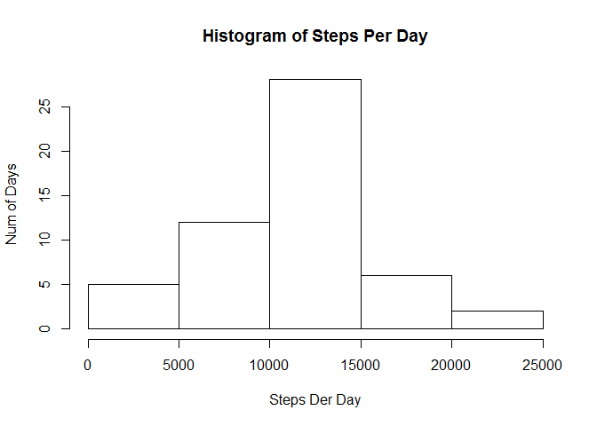
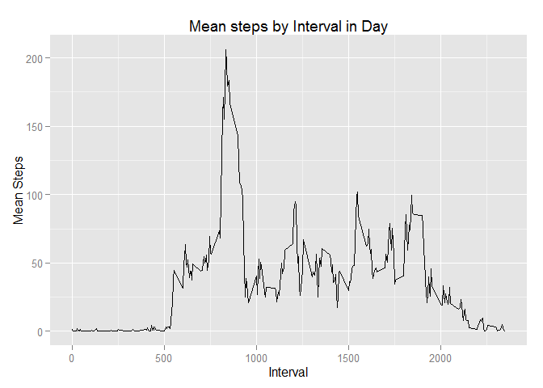
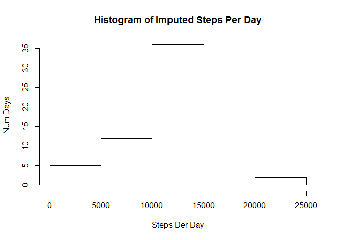
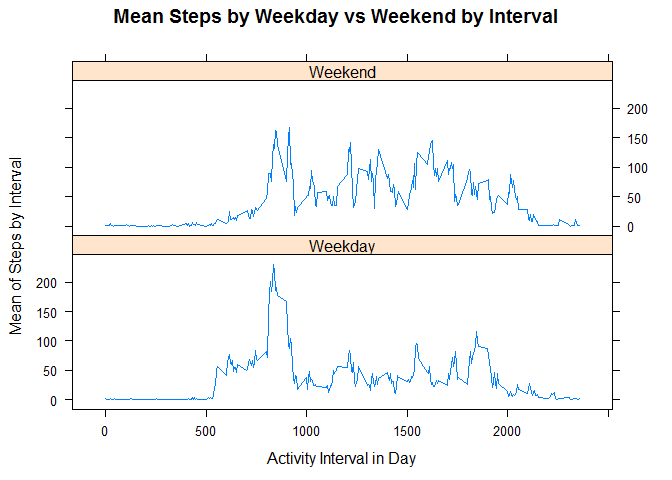

# Reproducible Research: Peer Assessment 1 -- Joe White


## Loading and preprocessing the data
This project loads and analyzes the activity data set available in the zip file in this repository.


###Libraries
We load the ggplot2 and lattice libraries for plotting histograms and time series plots later in the project

```r
  library(ggplot2)
  library(chron)
  library(lattice)
```
###1. Load the data
The next step is to read the activity.csv file and to create the activityClean data set that excludes all rows where no step data was captured

```r
  activityData <- read.csv("activity.csv")
```

###2. Process/transform the data (if necessary) into a format suitable for your analysis

```r
activityClean <- activityData[!is.na(activityData$steps),]
```
  
## What is mean total number of steps taken per day?

###1. Calculate the total number of steps taken per day
The aggregrate function is used to create a data frame that sums all of the steps on each day. Once that dataset is created the histogram is generated

```r
activityByDay <- aggregate(activityClean[,c("steps")],by=list(activityClean$date),"sum")
```

###2. Make a histogram of the total number of steps taken each day

```r
hist(activityByDay$x, xlab="Steps Der Day", main="Histogram of Steps Per Day", ylab="Num Steps")
```

 

###3. Calculate and report the mean and median of the total number of steps taken per day
The mean steps per day is:

```r
mean(activityByDay$x)
```

```
## [1] 10766.19
```

The median steps per day is:

```r
median(activityByDay$x)
```

```
## [1] 10765
```

## What is the average daily activity pattern?

###1. Make a time series plot (i.e. type = "l") of the 5-minute interval (x-axis) and the average number of steps taken, averaged across all days (y-axis)
The aggregrate function is used to create a data frame that calculates the mean of all the steps on a per interval basis. Then ggplot is used to generate the time series


```r
activityByInterval <- aggregate(activityClean[,c("steps")],by=list(activityClean$interval),"mean")

ggplot(activityByInterval, aes(activityByInterval$Group.1, activityByInterval$x)) + geom_line() +xlab("Interval")+ylab("Mean Steps")+ggtitle("Mean steps by Interval in Day")
```

 

###2. Which 5-minute interval, on average across all the days in the dataset, contains the maximum number of steps?

The maximum five minute intervale during the day is:


```r
activityByInterval[activityByInterval$x == max(activityByInterval$x), 1]
```

```
## [1] 835
```

## Imputing missing values

###1. Calculate and report the total number of missing values in the dataset (i.e. the total number of rows with NAs)
The calculation is performed using is.na function on the original data set and the total is reported via the lenght call. The number of rows missing data is:

```r
missing<-which(is.na(activityData$steps))
length(missing)
```

```
## [1] 2304
```
###2. Devise a strategy for filling in all of the missing values in the dataset. The strategy does not need to be sophisticated. For example, you could use the mean/median for that day, or the mean for that 5-minute interval, etc.

The strategy used is to use the mean of the interval across all days. For example, if an interval labeled 10 is missing the steps value then the imputed value is the mean value of all intervals labeled 10 on every other day. To capture this we create a copy of the original data and then find the mean for the interval using the data captured in the average daily activity pattern section above.


```r
imputedDataSet <- activityData

for (i in missing){
  imputedDataSet[i,1] <- activityByInterval[activityByInterval$Group.1 == imputedDataSet[i,3],2]
}
```
###3. Make a histogram of the total number of steps taken each day and Calculate and report the mean and median total number of steps taken per day. Do these values differ from the estimates from the first part of the assignment? 


```r
imputedByDay <- aggregate(imputedDataSet[,c("steps")],by=list(imputedDataSet$date),"sum")
hist(imputedByDay$x, xlab="Steps Der Day", main="Histogram of Steps Per Day", ylab="Num Steps")
```

 

The mean of the imputed data is:

```r
mean(imputedByDay$x)
```

```
## [1] 10766.19
```

The median of the imputed data is:

```r
median(imputedByDay$x)
```

```
## [1] 10766.19
```

###What is the impact of imputing missing data on the estimates of the total daily number of steps?
As you can see above there is no change in the mean. This is because the strategy used only adds values that are equal to the mean of the data set. If you add values equal to the mean of a data set then the mean of the new data will not have changed from the original.

The median moved slightly towards the mean because we added many values exactly at the mean.

## Are there differences in activity patterns between weekdays and weekends?

###1. Create a new factor variable in the dataset with two levels - "weekday" and "weekend" indicating whether a given date is a weekday or weekend day.

This section creates a boolean variable based on the is.weekend() function from the chron library. Then a factor variable is added to the data set  to hold the Weekday and Weekend factor values.


```r
imputedDataSet$isWeekend <- is.weekend(imputedDataSet$date)
activityByDayTypeByInterval <- aggregate(imputedDataSet[,c("steps")],by=list(imputedDataSet$interval, imputedDataSet$isWeekend),"mean")
activityByDayTypeByInterval[activityByDayTypeByInterval$Group.2==FALSE,4] <- "Weekday"
activityByDayTypeByInterval[activityByDayTypeByInterval$Group.2==TRUE,4] <- "Weekend"
```

###2. Make a panel plot containing a time series plot (i.e. type = "l") of the 5-minute interval (x-axis) and the average number of steps taken, averaged across all weekday days or weekend days (y-axis).

The lattice package xyplot is used to create a panel plot showing the mean steps by interval for Weekday vs Weekend.


```r
xyplot(activityByDayTypeByInterval$x ~ activityByDayTypeByInterval$Group.1 | activityByDayTypeByInterval$V4, layout=c(1,2),activityByDayTypeByInterval,type="l", xlab="Activity Interval in Day", ylab="Mean of Steps by Interval", main="Mean Steps by Weekday vs Weekend by Interval")
```

 

